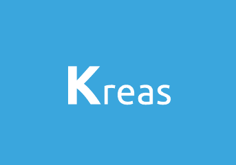

<p align="center">
  
</p>


> “The most powerful tool we have as developers is automation.”
> —Scott Hanselman

This is an easly CLI open-source tool that help you manage your devops projects. 
It was designed to be a community tool that will evolve according to everyone's comments. Do not hesitate to give us feedback.

### Tech

Kreas is based on number of open source projects:

* [Ansible](https://www.ansible.com/) - Ansible is the simplest way to automate apps and IT infrastructure. Application Deployment + Configuration Management + Continuous Delivery.
* [Terraform](https://www.terraform.io/) - Terraform enables you to safely and predictably create, change, and improve infrastructure.
* [Helm](https://helm.sh/) - Helm helps you manage Kubernetes applications — Helm Charts help you define, install, and upgrade even the most complex Kubernetes application.
* [Kubernetes](https://kubernetes.io/) - Kubernetes (K8s) is an open-source system for automating deployment, scaling, and management of containerized applications.


### Installation

Kreas is written in [Golang](https://golang.org/).

Downlad the binary from latest [release](https://github.com/mholleville/kreas/releases) and move in your `/bin` path.

```sh
$ mv ./kreas ${BIN_PATH}/kreas
$ kreas --help
```

### Build from source

Kreas need [Go 1.13](https://golang.org/).

Downlad the source code project.

```sh
$ git clone https://github.com/mholleville/kreas.git
$ go build -o kreas && go install kreas
$ kreas --help
```

### Usage

You can run `kreas --help` for viewing all the options.

```bash
$ kreas --help
NAME:
   ** Kreas ** - Kreas is an open-source tool to help you organize your DevOps project

USAGE:
   kreas [global options] command [command options] [arguments...]

VERSION:
   0.0.1

AUTHOR:
   mholleville

COMMANDS:
   init, i  options for project init
   help, h  Shows a list of commands or help for one command

GLOBAL OPTIONS:
   --help, -h     show help
   --version, -v  print the version
```

##### Create an `helm` project

The following command will create a kreas `helm` project. The project contains an `Helm` project. 

```bash
$ kreas init helm
```

This command adds configuration elements that the `helm create` command does not add.

##### Create a `terraform` project

The following command will create a kreas `terraform` project. The project contains a `Terraform` project who respect the best practices. 

```bash
$ kreas init terraform
```

##### Create an `ansible` project

The following command will create a kreas `ansible` project. The project contains an `Ansible` project who respect the best practices. 

```bash
$ kreas init ansible
```

### Contributing

And if you have features that you'd really like to see in `kreas`, please check out the [contributing](https://github.com/mholleville/kreas/blob/master/.github/CONTRIBUTING.md) page

